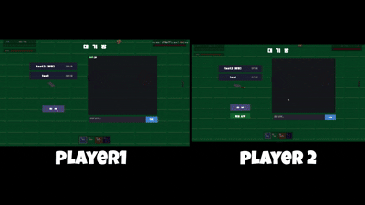

# BulletHell PvP



Unity로 만든 **1:1 실시간 온라인 탄막 PvP 게임**입니다.
로그인 → 방 목록 → 대기방(채팅·준비) → 대전으로 이어지는 흐름을 갖추고, 위치·탄막은 UDP 릴레이로, 게임 이벤트는 WebSocket으로 동기화합니다.

- **개발 기간:** 2026.03.22 ~ 2026.06.11
- **개발 인원:** 1인 개발
- **담당 역할:** 전체 — Unity 클라이언트, Node.js 릴레이 서버, 인증/방 관리 API 서버, 클라우드·자택 서버 인프라 구성
- 이 저장소는 원본 개발 저장소에서 서드파티 에셋과 운영 서버 정보를 제외하고 옮긴 **공개용 미러**입니다. 원본의 커밋 기록은 포함되어 있지 않습니다.

> 운영 서버는 현재 닫혀 있어 온라인 대전은 동작하지 않습니다. 에셋 출처는 [CREDITS](CREDITS.md)를 참고하세요.

## 주요 기능

- **온라인 1:1 대전** — 로그인(JWT), 방 생성·입장, 대기방 채팅·준비·카운트다운, 승패 기록 (`ApiClient`, `NetworkManager`, `WaitingRoomUI`, `RoomListUI`)
- **탄막 패턴** — 직선 / 부채꼴 점사 / 8방향, 슬롯 1~3 전환 (`BulletShooter`)
- **특수 무기** — 맵에 놓인 무기를 E키로 획득: 회전하며 휘어지는 강화 스파이럴, 느리게 출발해 급가속하는 크러셔, 거리에 따라 유도력이 달라지는 호밍 (`WeaponPickup`, `Bullet`)
- **이동 & 대시** — Rigidbody 기반 이동, 쿨다운 대시, 마우스 조준 (`PlayerController`)
- **HUD** — 양측 HP바, 퀵슬롯, 특수탄 잔량, 대시 쿨다운 (`GameUI`)
- **로컬 2인 테스트 씬** — 서버 없이 한 PC에서 두 플레이어 조작 (`TestScene`, `TestHelper`)

## 설계 포인트

- **전송 계층 분리** — 입장·준비·게임 시작·사망처럼 반드시 도착해야 하는 이벤트는 WebSocket(TCP)으로, 초당 20회 보내는 위치와 탄막은 UDP로 보냅니다. UDP 패킷에는 종류별 시퀀스 번호를 붙여 늦게 도착한 패킷과 중복 패킷을 버립니다.
- **탄 하나하나가 아닌 '발사 이벤트' 동기화** — 탄 위치를 매 프레임 보내지 않고 발사 위치·방향·패턴·파라미터만 보냅니다. 받은 쪽이 같은 규칙으로 탄막을 다시 만들기 때문에 8방향 탄막도 패킷 1개로 끝납니다.
- **데드 레커닝** — 발사 패킷의 타임스탬프로 지연 시간을 구하고, 그만큼 이미 날아간 위치에서 탄을 생성합니다. 크러셔처럼 속도가 바뀌는 탄은 감속·가속 구간을 나눠 이동 거리를 계산합니다. 500ms를 넘는 지연은 보정 상한으로 자릅니다.
- **피격자 판정 방식** — 각 클라이언트는 자기 캐릭터가 맞았는지만 판정하고, 결과를 `HIT` 패킷으로 알립니다. 패킷에 데미지와 함께 현재 HP를 넣어, 중간 패킷이 유실돼도 다음 패킷에서 HP가 맞춰집니다.
- **스레드 경계 처리** — WebSocket·UDP 수신은 백그라운드 스레드에서 하고, `ConcurrentQueue`에 쌓아 메인 스레드의 `Update`에서 처리합니다. Unity API는 메인 스레드에서만 호출됩니다.
- **하나의 씬으로 양쪽 시점 처리** — 두 클라이언트가 같은 `GameScene`을 쓰고, 서버가 알려준 순번이 2번이면 `GAME_START` 시점에 로컬/원격 플레이어 역할·카메라·HUD 참조를 뒤바꿉니다.
- **코드로 씬 생성** — `SceneBuilder` 에디터 스크립트가 메뉴 한 번으로 4개 씬, UI, 프리팹, 머티리얼을 만듭니다. 씬 파일을 손으로 고치지 않아 설정이 꼬이지 않고, 구조를 바꿀 때 다시 생성하면 됩니다.
- **가벼운 릴레이 서버** — UDP 릴레이는 패킷에서 `playerId`·`roomId`만 읽고 원본 바이트를 그대로 상대에게 넘깁니다. 클라이언트별 초당 패킷 제한과 10초 무응답 세션 정리를 넣었습니다. ([relay/](relay/))

네트워크 구성과 메시지 프로토콜은 [docs/ARCHITECTURE.md](docs/ARCHITECTURE.md)에 정리했습니다.

## 기술 스택

- **클라이언트:** Unity 6 (6000.3.11f1), C#, URP, Input System, TextMesh Pro
- **릴레이 서버:** Node.js, `ws`, `dgram`, `jsonwebtoken`, PM2
- **API 서버:** Python FastAPI (저장소 미포함)
- **인프라:** AWS Lightsail, nginx, Tailscale, Cloudflare Tunnel, Docker Compose

## 개발 도구

- AI 코딩 보조 도구(Claude Code)를 구현 보조와 디버깅에 활용했으며, 설계 결정과 코드 검토는 직접 수행했습니다.

## 프로젝트 구조

```
client/                 Unity 프로젝트
  Assets/Scripts/
    Network/            NetworkManager (WS·UDP), ApiClient (REST)
    Player/             이동·대시, 탄막 발사, HP
    Bullet/             탄 이동·피격·데드 레커닝, 피격 이펙트
    Item/               특수 무기 픽업
    UI/                 로그인, 방 목록, 대기방, 인게임 HUD
    Editor/             SceneBuilder (씬·프리팹 자동 생성)
  Assets/Scenes/        MainMenu, RoomList, GameScene, TestScene
relay/                  Node.js WebSocket + UDP 릴레이 서버
docs/                   아키텍처 문서
```

## 조작법

| 동작 | P1 | P2 (TestScene 로컬 2인) |
|---|---|---|
| 이동 | WASD | IJKL |
| 조준 | 마우스 | 이동 방향 |
| 발사 | 마우스 좌클릭 | 마우스 우클릭 |
| 패턴 전환 / 특수 무기 | 1 · 2 · 3 / 4 | 숫자패드 1 · 2 · 3 / 4 |
| 대시 | Space | 오른쪽 Shift |
| 무기 줍기 | E | — |

## 소스에서 열기

1. Unity **6000.3.11f1**로 `client/` 폴더를 엽니다.
2. `Window > TextMeshPro > Import TMP Essential Resources`를 실행합니다.
3. 에셋은 저장소에 없으므로 모델·폰트·이펙트가 빠진 상태로 열립니다. [CREDITS](CREDITS.md)의 에셋을 받아 `Assets/graphic`, `Assets/animation`, `Assets/font`, `Assets/Effects`에 넣은 뒤 **BulletHell > Create All Scenes** 메뉴로 씬을 다시 만들 수 있습니다.
4. 온라인 기능을 쓰려면 `ApiClient.cs`의 `BaseUrl`을 직접 띄운 API 서버 주소로 바꾸고, [relay/](relay/)를 실행합니다.
